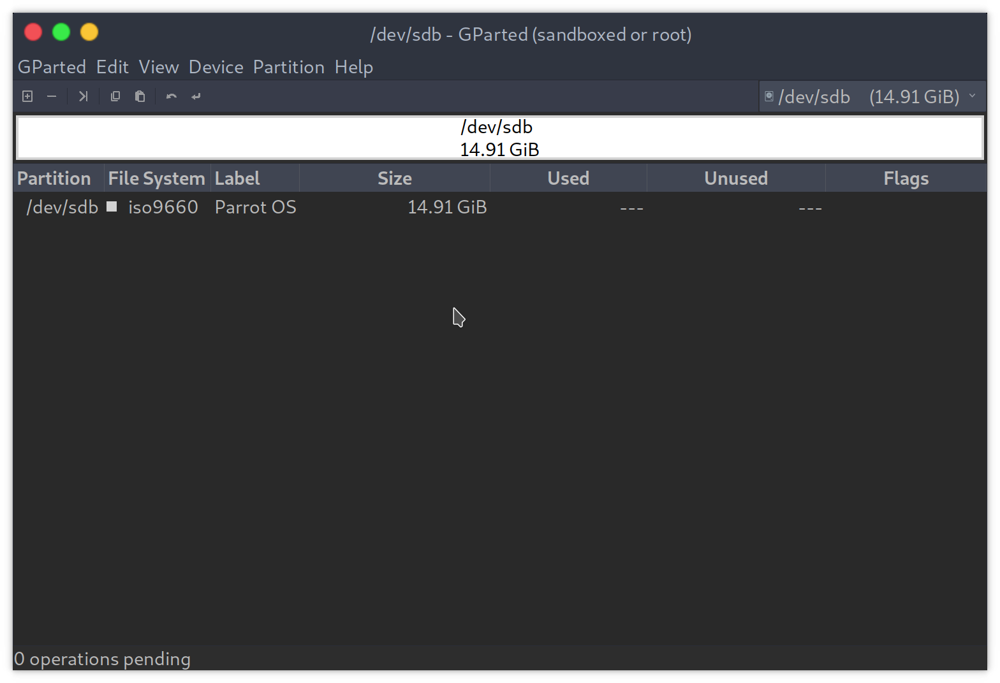
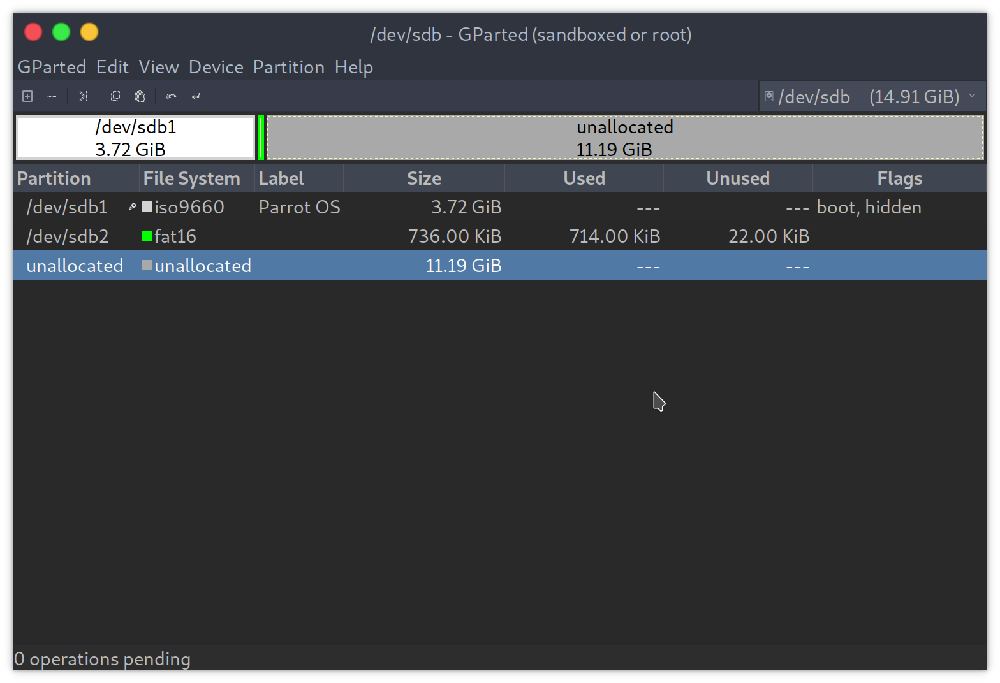
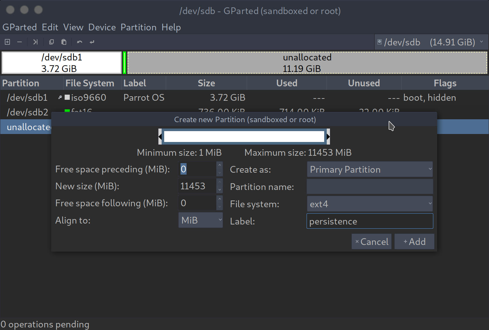

Apart from working as a developer, I also do some server administration in my spare time. Mostly as a devops for projects which I write, but also I [host](/blog/build-your-own-cloud-fast-thanks-to-ansible-and-automation/) [my](/blog/adding-email-server-autoconfig-and-autodiscover/) [own](/blog/setting-encrypted-backup-email-server/) [server](/blog/installing-custom-linux-on-raspberry-pi-2/) with mail, git etc. I keep a lot of private info there, so naturally I had to learn a lot about securing it and keeping it as safe as possible.

However I always did it from "defendant" perspective, and learned techniques connected mostly with that (closing ports, configuring firewalls etc.). Recently I came to conclusion, that this may be not enough - I have to start thinking as an attacker, to better understand the tools and tricks used in todays cyberworld.

To do that, I started reading security blogs, collecting tools and playing with self-prepared vulnerable virtual machines. Really quickly my laptop got filled with a lot of stuff which I used to play with, adding more and more mess. And as a programmer, with strong belief in "Single responsibility principle", I didn't like that - my base system should be used only for my daily needs and I need to separate my "hacker wanna be" activities. So, naturally I started looking for some specialised Linux distro just for that.

Everybody heard about Kali Linux (formerly known as BackTrack), so naturally I started there. And I didn't like what I found - it felt bloated, sluggish - more like "Debian + pentesting friends" instead of a distro built from scratch with hacking principle in mind. A lot of people use it, and are happy for it - but for me it didn't feel right.

And then I discovered Parrot OS, and immediately felt in love with it. It's beautiful (when you work a lot with designers, at some point you start noticing things like that), fast, has all the tools and as a bonus - it's built from scratch with privacy in mind.

Setting up a pendrive with Live distro is a breeze - just download ISO, and flash it. However it gets a little wild, when you want to set a permanent, encrypted storage for it. Hence this guide.

## Step 1: Flash Parrot OS to pendrive

This step is pretty simple and self explanatory - just download the ISO and flash it. There are plenty, fancy tools for that, but good, old `dd` is still best suited for the job.

```bash
dd if=Parrot-security-4.6_amd64.iso of=/dev/rdisk2 bs=1m
```

On OSX, it is important to use `/dev/rdiskX` instead of `/dev/diskX` as it provides raw (thus way faster) access to the device. On Linux, just pass `/dev/sdX` as you normally do.

## Step 2: Partition the pendrive

Okay, we have our distro set up, let's give it a spin! You may notice many `GRUB` options, but for now - let's go with basic, Live USB.

### Dealing with gparted and ISO partition

> This was an issue at the time of writing this article, with `gparted` versions above `0.28`. If it doesn't apply to you, you can skip this section.

> You can also create a partition using good, old `fdisk` which handles this case properly.

The next step is to partition the disk - you will notice something odd, immediately after starting `gparted` and switching to your pendrive.



Whole disk is occupied by mysterious "iso" volume, despite the fact the image was only 4GB! Clearly, something is wrong with partition table. Let's check offsets with wipefs:

```bash
# wipefs /dev/sdb
DEVICE OFFSET      TYPE    UUID                   LABEL
sdb    0x8001      iso9660 2019-04-25-11-04-24-00 Parrot OS
sdb    0x1fe       dos
sdb    0x3ba2ffe00 gpt
```

You may notice, that `/dev/sdb` contains signatures of two (or three) different data structures - an ISO image written to the whole disk, a DOS partition table, and optinally - a GPT partition scheme signature. When you check your drive with `blkid`...

```bash
# blkid /dev/sdb
/dev/sdb: UUID="2019-04-25-11-04-24-00" LABEL="Parrot OS" TYPE="iso9660" PTUUID="f3dc8ed4" PTTYPE="dos"
```

... you will notice, that ISO partition is the preferred one. That's why gparted gets crazy and reports it as a whole drive. Thankfully, the fix is pretty easy - just wipe out information about ISO:

```bash
# wipefs -o 0x8001 -f /dev/sdb
/dev/sdb: 5 bytes were erased at offset 0x00008001 (iso9660): 43 44 30 30 31
```

Since you will be altering already mounted partition, don't forget `-f` flag to force the overwrite. After that, `gparted` should start reporting partition and free space correctly.



### Partition the free space

This is pretty straightforward - create a new partition over free space, set it's type to `ext4` and label to `persistence`. Then apply the changes.



## Step 3: Encrypt the partition

This step is optional - however, it's a good habit to encrypt everything. I see no reason for exceptions here.

First, set encrypted luks volume over a newly created partition:

```bash
# cryptsetup --verbose --verify-passphrase luksFormat /dev/sdb3
WARNING: Device /dev/sdb3 already contains a 'ext4' superblock signature.

WARNING!
========
This will overwrite data on /dev/sdb3 irrevocably.

Are you sure? (Type uppercase yes): YES
Enter passphrase for /dev/sdb3:
Verify passphrase:
Existing 'ext4' superblock signature on device /dev/sdb3 will be wiped.
Key slot 0 created.
Command successful.
```

Next, attach it:

```bash
# cryptsetup luksOpen /dev/sdb3 my_part
Enter passphrase for /dev/sdb3:
```

Now we can format it or create multiple LVMs - it's up to you. Since it's a pendrive, I decided to not go crazy, and just created one `ext4` partition, filling up all the space (don't forget to label it):

```bash
# mkfs.ext4 -L persistence /dev/mapper/my_part
mke2fs 1.44.5 (15-Dec-2018)
Creating filesystem with 2931456 4k blocks and 732960 inodes
Filesystem UUID: 592d5d84-f630-4e80-9ea9-0c9973be68f4
Superblock backups stored on blocks:
    32768, 98304, 163840, 229376, 294912, 819200, 884736, 1605632, 2654208

Allocating group tables: done
Writing inode tables: done
Creating journal (16384 blocks): done
Writing superblocks and filesystem accounting information: done

# e2label /dev/mapper/my_part persistence

# mount /dev/mapper/my_part /mnt
```

Now, we need to configure Parrot to treat this new partition as a volume which would store it's data. This is done by one line in persistence configuration file.

```bash
# echo "/ union" > /mnt/persistence.conf
```

That's it! Umount the partition, and close the luks volume.

```bash
# umount /mnt
cryptsetup luksClose /dev/mapper/my_part
```

### Optional: Set a nuke password

Newer versions of luks provide interesting functionality - a "nuke" password. The idea is simple - if you are forced to reveal the password, you can provide the "nuke" one instead of the real thing, and your partition will be unrecoverably destroyed (thus "nuke").

Personally I don't see any sense in it - if the forensic is smart, he would make a one to one copy as a first thing which would render nuking pointless - but hey, you can always meet somebody less sharp, and it may actually help.

To add a nuke, simply invoke:

```bash
# cryptsetup luksAddNuke /dev/sdb3
Enter any existing passphrase:
Enter new passphrase for key slot:
Verify passphrase:
```

Do not mix those passwords yourself, as nuked partition is unrecoverable.

## Step 4: Reboot

We're done. Reboot Parrot, and select `Encrypted persistence` option. In this mode, everything you do, will be saved to the pendrive.

Now, you can wear your obligatory hoodie, play some hacker music and start nuking Gibsons!

### Sources

* [https://bugzilla.gnome.org/show\_bug.cgi?id=789898](https://bugzilla.gnome.org/show_bug.cgi?id=789898)
* [https://community.parrotsec.org/t/live-usb-with-persistence/3359/5](https://community.parrotsec.org/t/live-usb-with-persistence/3359/5)
